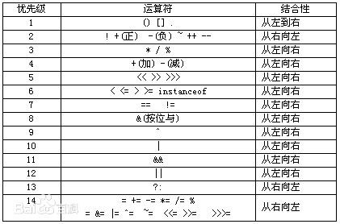

# C++
## 1、vector 几种初始化

```c++
vector<int> ilist1、vector<int> ilist2  = ilist; 
vector<int> ilist2(ilist)、vector<int> ilist4(7)、vector<int> ilist5(7,3);
vector<int> ilist = {xxx}
vector<int> ilist3(ilist.begin()+2,ilist.end()-1);
```

## 2、虚表指针和虚表

每个同类对象中都有个一个`vptr`，指向内存中的vtable，所有同类对象，共享一个vtable

虚表指针是对象的`第一个数据成员`，也就是说对象的首地址就是虚表指针的首地址

虚表（虚表存储在数据段）的地址存放在<u>对象的起始位置</u>，即对象的第一个数据成员就是它的虚表指针，同时注意到，虚表指针的初始化发生在构造函数过程中

[参考博客](https://www.cnblogs.com/lsh123/p/7429475.html)

[虚函数表，虚表指针，内存分布](https://blog.csdn.net/li1914309758/article/details/79916414)

## 3、C++中基类的析构函数为什么要用virtual虚析构函数

> 假设基类中采用的是非虚析构函数，当删除基类指针指向的派生类对象时就不会触发动态绑定，因而只会调用基类的析构函数，而不会调用派生类的析构函数。那么在这种情况下，派生类中申请的空间就得不到释放从而产生内存泄漏。所以，为了`防止内存泄漏`的发生，C++中基类的析构函数应采用virtual虚析构函数。

[参考博客](https://blog.csdn.net/yhc166188/article/details/81587442)


## 4、符号的优先级问题



## 5、函数指针的写法以及typedef写法

形式1：`返回类型(*函数名)(参数表)`

形式2：`typedef  返回类型(*新类型)(参数表)`

我们要从指针的层次上理解函数——函数的**函数名实际上就是一个指针**，函数名指向该函数的代码在内存中的**首地址**

```c++
typedef char (*PTRFUN)(int);   
PTRFUN pFun;   
char glFun(int a){ return;}   
void main()   
{   
    pFun = glFun;   
    (*pFun)(2);   // 前面加括号应该是  * 优先级小，
}   
```


[参考博客](https://www.cnblogs.com/zhubaohua-bupt/p/7182803.html)


## 6、字符串操作

string的`substr(下标，长度)`

string转char*：`c_str()`。反过来直接赋值就好

[char、char*、string之间互转](https://www.cnblogs.com/qiumingcheng/p/11204863.html)


## 7、error: passing xxx as 'this' argument of xxx discards qualifiers的解决办法

编译器认为成员函数可能会修改被const限定的变量

那解决不就是要么不让编译器认为，代码上对const修饰不调用方法，只读它

或者把const修饰去掉

[参考博客](https://blog.csdn.net/LonelyGambler/article/details/84933917)