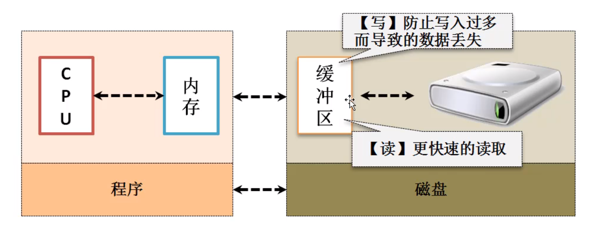

# JAVAIO

- [ ] BIO、IO、NIO区别：https://zhidao.baidu.com/question/626748422135466004.html 、 https://www.cnblogs.com/ljl150/p/12642726.html 、 https://blog.csdn.net/u010541670/article/details/91890649
- [ ] dubbo、redis底层：netty。redis的IO复用是什么
- [ ] IO、NIO的场景选择：http://tutorials.jenkov.com/java-nio/nio-vs-io.html

## 前言

?> 之前一直C++做题，现在用Java写过项目了，想用Java做题，却发觉不会读取信息，在了解了如何读取信息之后，我想着JavaIO也是一个很重要的部分，之前也学过NIO（忘了），所以就想把JavaIO也学了，对比一下NIO，并整理起来。


**JAVA_IO核心组成如下，本文已经按着这些来编排：**

- 一个类（File）
- 一个接口（Serializable）
- 四个抽象类（InputStream、OutputStream、Reader、Writer）


根据**处理数据类型的不同**分为：字符流和字节流

根据**数据流向不同**分为：输入流和输出流


## File

File的操作过程如图，从我们的JAVA代码进行IO操作，到真正写入硬盘，有这些中间过程


### 创建一级目录文件

!> 编码使用 `File.separator` 作为分隔符，兼容各个系统不同分隔符

> 在unix环境下，目录中的间隔符是正斜线`/`。
> window环境下，目录的间隔符可以是正斜线或是反斜线，如果要使用反斜线，就必须转义使用`\\`

new File(String) **只是一个标识，只要没进行文件操作，不管文件存不存在，不会报错**

exists、delete、createNewFile、getAbsolutePath函数（早期的，所以命名规范可能不好）

```java
public static void main(String[] args) throws IOException {
    // 使用 File.separator 作为分隔符，兼容各个系统不同分隔符
    File file = new File("D:"+ File.separator + "demo.txt");
    if (file.exists()) {
        file.delete();
        System.out.println("删除文件");
    } else {
        file.createNewFile();
        System.out.println(file.getAbsolutePath());
        System.out.println("创建文件");
    }
}
```


### 创建多级目录文件

!> 不能直接createNewFile()，会报错

```java
Exception in thread "main" java.io.IOException: 系统找不到指定的路径。
	at java.io.WinNTFileSystem.createFileExclusively(Native Method)
	at java.io.File.createNewFile(File.java:1012)
	at IO.FileLearn.main(FileLearn.java:17)
```

> 应该获取该文件的父目录，先getParentFile()获取父目录的File实例，再用这个实例调用mkdirs()创建出多级目录，即如下图红底逻辑

?> 如果多线程访问呢，那这个判断是不是就很浪费时间，如何优化？

A：使用静态代码块（优先于主方法执行）


```java
public class FileLearn {
    private static File file = new File("D:"+ File.separator + "lhw" + File.separator + "niubi" + File.separator + "demo.txt");
    // 只执行一次
    static {
        if (!file.getParentFile().exists()) {
            file.getParentFile().mkdirs();
        }
    }
    public static void main(String[] args) throws IOException {
        if (file.exists()) {
            file.delete();
            System.out.println("删除文件");
        } else {
            file.createNewFile();
            System.out.println(file.getAbsolutePath());
            System.out.println("创建文件");
        }
    }
}
```

### 一些方法

canExecute()、canRead()、canWrite()：是否可读可写可执行

getAbsoluteFile()、getAbsolutePath()、getName()：绝对路径（返回File实例或字符串），文件或目录名称

isDirectory()、isFile()：是目录还是文件

lastModified()、length()：最后一次修改日期（毫秒数），文件长度（字节个数），都是long


list()和`listFiles()`推荐后者，因为后者会**包括全路径信息**，前者只有文件名

?> 一个递归扫描所有文件的方法

```java
public static void listDir(File file) {
    if (file.isDirectory()) {
        File[] files = file.listFiles();
        if (files != null) {
            for (File file1 : files) {
                listDir(file1);
            }
        }
    }
    System.out.println(file);
}
```

**文件更名操作**，需求就是各文件名字长度一样，即lhw-202007161815-1.txt、lhw-202007161815-105.txt，前者操作完后要lhw-202007161815-001.txt，因为105是3位的。听说这是一道面试题，于是乎我也自己实践了一波，主要还是`递归、切分字符串、renameTo()`


## 字节流与字符流、输入流与输出流

上面介绍的File类实现了自身的操作，而`文件内容的操作并没有指明，需要用流的概念完成`

流的定义：数据的处理方式、目标内容的处理机制。


根据**处理数据类型**的不同分为：字符流和字节流

根据**数据流向**不同分为：输入流和输出流，不是绝对的，是相对的，一个个体可以都是


`字节流：InputStream（字节输入流）、OutputStream（字节输出流）`

`字符流：Reader（字符输入流）、Writer（字符输出流）`

<mark>注：字节、字符其实最大区别体现在**中文**的处理方式上 </mark>


?> 基本操作如下：

- 通过File类设定要操作的路径（针对文件流，网络流另说）
- 通过字节/字符流的`子类`为父类这个抽象类进行对象实例化处理
- 进行读、写操作
- 流很宝贵，**一定要关闭资源**


### OutputStream

里面的write()方法<mark>都是针对字节数据 </mark>

- write(int b)：单个字节数据
- write(byte[] b)：全部字节数组数据
- write(byte[] b, int off, int len)：部分字节数组数据


?> **缓存问题**，CPU很快，与内存打交道，然后磁盘有缓存，内存和这个缓存打交道。




!> AutoCloseable就是使得你用try、catch能自动关闭，这个Flushable接口就是让你有清空缓存区的功能。

> flush() 是清空，而不是刷新啊。
> 一般主要用在IO中，即清空缓冲区数据，就是说你用读写流的时候，其实数据是先被读到了内存中，然后用数据写到文件中，当你数据读完的时候不代表你的数据已经写完了，因为还有一部分有可能会留在**内存这个缓冲区**中。这时候如果你调用了 close()方法关闭了读写流，那么这部分数据就会丢失，所以应该在关闭读写流之前先flush()，先清空数据。

关键就是理解好之间的继承关系，剩下的就是**利用多态特性，操作抽象类，只需关注子类的构造方法即可**，具体的操作实现和操作系统命令有关（在学完操作系统的课程，我觉得这些操作很多都匹配得上某些命令）

FileOutputStream(File file)：每次对内容覆盖

FileOutputStream(File file, boolean append)：第二个参数让其控制是否对内容追加


```java
public static void main(String[] args) throws IOException {
    // 需要
    OutputStream ops = new FileOutputStream(new File("D:" + File.separator + "lhw" + File.separator + "test.txt"));
    // 操作的是字节数据，所以得转
    ops.write("lhw is handsome man".getBytes());
    ops.close();
}
```

### InputStream

不需要刷新缓存区，只有写需要（防止丢失数据）

同样的用多态特性，子类实例化，操作抽象类


int read()：读单个字节，没有就-1

`int read(byte[] b)`：尽可能读取放在传的这个字节数组，没有就-1

int read(byte[] b, int off, int len)：读取部分内容到字节数组，没有就-1

!> 注：1.9出了一个返回全部内容的字节数组，不需要自己分配，但数据量一多，这个数组可能OOM

byte[] readAllBytes()，**不推荐使用**，可以配合int available()获取可用的长度去判断用不用该方法

```java
File file = new File("D:" + File.separator + "lhw" + File.separator + "test.txt");
if (file.exists()) {
    InputStream ips = new FileInputStream(file);
    byte[] arr = new byte[1024];
    int len = ips.read(arr);
    // arr可能没填满，就构造一个刚好读到的长度
    System.out.println("【" + new String(arr, 0, len) + "】");
}
```


### Writer

上面两个都是**操作字节**，而大部分情况我们都是操作字符串，为了简化操作，1.1引入了字符流

多实现了一个Appendable接口

!> 注：CharSequence是一个描述字符串结构的接口，在这个接口里面一般发现有三种常用的子类。这就意味着**Writer可以直接操作String、StringBuffer、StringBuilder实例**


```java
public class WriterLearn {
    private static File file = new File("D:" + File.separator + "lhw" + File.separator + "test.txt");
    static {
        if (!file.getParentFile().exists()) {
            file.getParentFile().mkdirs();
        }
    }
    public static void main(String[] args) throws IOException {
        Writer writer = new FileWriter(file);
        // 覆盖
        writer.write("777");
        // 各种实现CharSequence接口的都能使用
        writer.append(new String("string"));
        writer.append(new StringBuilder("StringBuilder\r\n"));
        writer.append(new StringBuffer("StringBuffer"));
        writer.close();
    }
}
```

### Reader、自动关闭

操作的是字符类型，即`char[]`

多实现了一个Readable接口（不过和我们现在说的IO无关）


上面OutputStream、InputStream、Writer、Reader都是AutoCloseable的子类，因此下面给一个自动关闭的例子：

```java
public static void main(String[] args) throws IOException {
    File file = new File("D:" + File.separator + "lhw" + File.separator + "test.txt");
    if (file.exists()) {
        // 放里面，自动关闭
        try (Reader reader = new FileReader(file)){
            char[] buf = new char[1024];
            int len = reader.read(buf);
            System.out.println(new String(buf, 0, len));
            // 不需要了
            //                reader.close();
        } catch (IOException e) {
            e.printStackTrace();
        }
    }
}
```

### 选择字节还是字符

从下图可以知道，终端用的都是字节，即二进制。

用字符的话，其实中间会有一个缓存区（可以用一个Writer验证，故意不close，文件其实没有任何东西，因为close其实会刷新缓存区，把内容写入）

显然这样的转换是有消耗的，因此如果<mark>**涉及中文就用字符，否则一律用字节**</mark>


### 转换

可以将**字节流==》字符流**，使用相应的`InputStreamReader、OutputStreamWriter`构造字节流就可以了

从继承关系就可以再次验证，<mark>**字符流是需要中间一层转换的，也就是说本质上FileWriter、FileReader都是字节，通过其【父类的转换流】转字符！！**</mark>


### 编码

`字节类型`可以进行**编码的转换处理**

GBK有繁体简体中文，GB2312只有简体中文

ISO8859-1国际通用编码标准，对图形文字要进行转码

Unicode使用十六进制可以描述所有文字信息，确定太大

UTF即ISO8859-1  +  Unicode，非图形化用ISO8859-1省空间，图形化没办法就切换为Unicode


?> 结论：什么时候都用UTF-8

**查看当前系统用的编码**

```java
System.getProperties().list(System.out)
```

`getBytes(“可以传编码”)`


## 内存流

注意我们要像站在文件的角度，去**站在内存的角度去想内存流的读与写**

文件流（程序和文件）：程序通过文件流从文件中读取input，往文件中写入output

内存流（程序和内存）：程序通过内存流从内存中读取input，往内存中写入output


构造方法：

ByteArrayInputStream(Byte[])：是说**把这个Byte[]的内容放在了内存**，非从内存读内容到数组

ByteArrayOutputStream()：构造空参


讲回JDK1.9 InputStream的 `byte[] readAllBytes()`，不推荐用，容易OOM

这个函数的意义在于直接返回一个**读取全部内容**的字节数组

> 既然一个byte[] 数组大小有限，他是如何将全部内容存放的？放在哪里?
> A：内存！！这也就引入了【内存流】，大数据都放在了内存，然后用`toByteArray()`方法直接返回存放在了内存的所有数据

因此，我们可以敲一下`readAllBytes()`的底层实现

```java
public static void main(String[] args) throws IOException {
    // 现在有这么一个需求：读取文件内容，写入内容，然后一下子全部内容返回
    byte[] buf = new byte[1024];
    InputStream is = new FileInputStream(file);
    //        OutputStream os = new ByteArrayOutputStream();
    // 用内存流
    ByteArrayOutputStream os = new ByteArrayOutputStream();
    int len;
    while ((len = is.read(buf)) != -1) {
        // 写到内存
        os.write(buf, 0, len);
    }
    // 把内存的所有内容转换成一个Byte[]
    System.out.println(new String(os.toByteArray()));
    is.close();
    os.close();
}
```


## 管道流

我们都知道线程之间是可以共享、通信的，进程之间才需要某个机制来通信，这就是`管道`。但是在Java中，一开始设计的时候他认为线程之间也需要管道来通信（其实是多余的，现在也有争议，**了解通信用管道就好**）


使用PipedInputStream、PipedOutputStream。他们的构造可以传另一个的实例，或者调用connect(xxx)进行绑定操作，绑定了才能通信。

```java
class SendThread implements Runnable {
    private PipedInputStream pis = new PipedInputStream();
    @Override
    public void run() {
        try {
            byte[] buf = new byte[1024];
            int len = pis.read(buf);
            System.out.println("收到： " + new String(buf, 0, len));
        } catch (IOException e) {
            e.printStackTrace();
        } finally {
            if (pis != null) {
                try {
                    pis.close();
                } catch (IOException e) {
                    e.printStackTrace();
                }
            }
        }
    }

    public PipedInputStream getPis() {
        return pis;
    }
}

class ReceiveThread implements Runnable {
    private PipedOutputStream pos = new PipedOutputStream();
    @Override
    public void run() {
        try {
            pos.write("i'm lhw".getBytes());
        } catch (IOException e) {
            e.printStackTrace();
        } finally {
            if (pos != null) {
                try {
                    pos.close();
                } catch (IOException e) {
                    e.printStackTrace();
                }
            }
        }
    }

    public PipedOutputStream getPos() {
        return pos;
    }
}


public class PipeStream {
    public static void main(String[] args) throws IOException {
        SendThread sendThread = new SendThread();
        ReceiveThread receiveThread = new ReceiveThread();
        // 绑定两个线程
        sendThread.getPis().connect(receiveThread.getPos());
        // 启动线程
        new Thread(sendThread).start();
        new Thread(receiveThread).start();
    }
}
```


## RandomAccessFile

这个类可以读、写，主要就是可以跳（学过操作系统应该知道本质就是操作文件偏移量），进而读取相应的内容（前提每项数据长度要一致，不然不知道跳多少）


```java
public class RandomAccessFileLearn {
    private static File file = new File("D:" + File.separator + "lhw" + File.separator + "randomaccessfile.txt");
    static {
        if (!file.getParentFile().exists()) {
            file.getParentFile().mkdirs();
        }
        if (!file.exists()) {
            try {
                file.createNewFile();
            } catch (IOException e) {
                e.printStackTrace();
            }
        }
    }
    public static void main(String[] args) throws IOException {
        RandomAccessFile raf = new RandomAccessFile(file, "rw");
        // 8位，要保持长度，所以空格
        String[] name = new String[] {"zhangsan", "lisi    ", "wangwu  "};
        int[] age = new int[] {18, 19, 20};
        // 写入
        for (int i = 0; i < 3; i++) {
            raf.write(name[i].getBytes());
            // 注意写int要用对应的方法
            raf.writeInt(age[i]);
        }
        raf.close();

        raf = new RandomAccessFile(file, "rw");
        byte[] buf = new byte[8];
        // 读取 lisi
        {
            raf.skipBytes(8+4);
            raf.read(buf);
            System.out.println(String.format("姓名：%s, 年龄：%d", new String(buf, 0, 8), raf.readInt()));
        }
        // 读取 zhangsan
        {
            // 偏移量弄回开头
            raf.seek(0);
            raf.read(buf);
            System.out.println(String.format("姓名：%s, 年龄：%d", new String(buf, 0, 8), raf.readInt()));
        }
        // 读取 wangwu
        {
            // 读完zhangsan，偏移量是12，再跳12就能读wangwu
            raf.skipBytes(8+4);
            raf.read(buf);
            System.out.println(String.format("姓名：%s, 年龄：%d", new String(buf, 0, 8), raf.readInt()));
        }
    }
}
```


## 打印流

原始的输出用OutputStream、Writer，不是说不好，只是功能少，只有一个write(byte[])，现在需要一个实现各个数据类型的输出

> 是不是就想到了我们的System.out.println，它好像就是这么一回事
>
> `打印流：PrintStream、PrintWriter`

可以发现PrintWriter更通用，能构造OutputStream、Writer两个，PrintStream只有一个

这种本质没变，只是封装得更好调用的叫`装饰者设计模式`


> 结论：
>
> 不用OutputStream、Writer来输出到文件等，用打印流更灵活（本质一样）
>
> <mark>非二进制数据，优先使用打印流的PrintWriter</mark>
>
> **只有二进制数据才使用OutputStream**

## 收获

程序性能提升都是一点点提升的，这里我就收获了得思考一下**一些操作是不是可以挪到静态代码块，从而只执行一次**


你要输出，你就得判断File标识的路径是否存在，模板如下：

```java
private static File file = new File("D:" + File.separator + "lhw" + File.separator + "test.txt");
static {
    if (!file.getParentFile().exists()) {
        file.getParentFile().mkdirs();
    }
}
```

你要输入，也是要判断，模板如下：

```java
if (file.exists()) {
    xxxx
}
```


手敲了文件拷贝代码（可能面试用上），了解到1.9之后有一个开发常用的`transferTo`方法，就是InputStream调用该方法，传OutputStream就能实现高性能的文件拷贝


## 资料

B站Java_IO视频（全程干货）：https://www.bilibili.com/video/BV1g4411H7Xj?p=18

