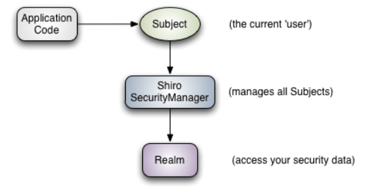

# Shiro

**Subject**：与当前应用交互的任何东西都是 Subject，如网络爬虫，机器人等；即一个抽象概念。把操作都交给SecurityManager这个执行者。

**SecurityManager**：关联Realm

**Realm**：连接数据的桥梁

几个需要的类

第一个类那里配置拦截器

拦截哪些页面，不拦截哪些

redirect是执行请求，不是返回页面，但重定向model的数据带不去，why？

在执行认证逻辑时，返回null

shiro底层会抛出UnKnowAccessException

UsernamePasswordToken携带用户名、密码

连接数据库试试，mybatis、mysql / mongodb

@Service

@Transactional

@MapperScan

Shiro的对外API核心就是Subject，所有 Subject 都绑定
到 SecurityManager，与 Subject 的所有交互都会委托给 SecurityManager；可以把 Subject 认
为是一个门面；SecurityManager 才是实际的执行者；类比如果学习过 SpringMVC，你可以把它看成 DispatcherServlet 前端控制器

从 Realm 获取安全数据（如用户、角色、权限）

需要给 Shiro 的 SecurityManager 注入 Realm，从而让 SecurityManager 能得到合法
的用户及其权限进行判断。

Shiro 不 不 提供 维护用户/ 权限，过 而是通过 Realm 让开 发人 员 自己 注入

身份验证

principals

credentials

shiro.ini