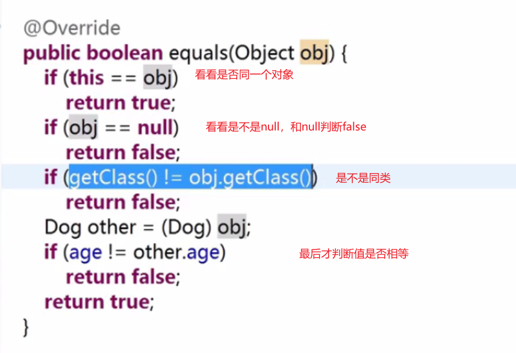

# 实战

## 待整理


## 1、容器、基本类型[]、包装类[]   的相互转换

写代码经常遇到int[] 转成一个 list，或者转成Integer[]等等情况


✨前置技能：流、函数式接口

注：函数式接口用到了简写方式，拿`list.forEach(System.out::print)`举例

```java
// 接受一个Consumer
void forEach(Consumer<? super T> action);
// Consumer要实现这个方法
void accept(T t);
// 比如我这样实现
// 这个print方法就是符合Consumer类型，即方法签名一样
list.forEach(str -> {
	System.out.print(str);
})
// 又因为System.out.println的参数 和 传递的参数element 的类型完全匹配
// 所以能简写成
list.forEach(System.out::print)
```


👑记忆，如A 转 B：

- A是[]的话，基本类型也好，包装类也好，有[]就`Arrays`，否则就是那个`list对象`
- 只要A、B不是包装类和List，一律`stream`。如果是这种情况呢
  1. 包装类[]转List。`Arrays.asList(integerArr)`
  2. List装包装类，据说new效果更好。`list2.toArray(new Integer[0])`
- 判断转的是包装类 or 基本类型，前者`boxed()`，后者映射`mapToxxx(函数式接口)`。List存的一定是包装类，不会出现基本类型的，因为泛型T是指对象。
- 同上，前者看转的是`List【collect(Collectors.toList())】`还是包装类`【toArray(包装类[]::new)】`。后者一定是`toArray()`


```java
package shizhan;

import java.util.Arrays;
import java.util.List;
import java.util.stream.Collectors;

/**
 * @author VVlhw
 * @date 2020/5/24 - 17:51
 */
public class ListConvert {
    public static void main(String[] args) {
        // Arrays.stream(arr) 可以替换成IntStream.of(arr)。

        int[] data = {1, 2, 3, 4, 5, 6};
      	

        // int[] 转 Integer[]
        Integer[] integerArr = Arrays.stream(data).boxed().toArray(Integer[]::new);
        System.out.println(Arrays.toString(integerArr));
        // Integer[] 转 int[]
        int[] arr = Arrays.stream(integerArr).mapToInt(Integer::valueOf).toArray();
        System.out.println(Arrays.toString(arr));

        // int[] 转 List<Integer>
        List<Integer> list = Arrays.stream(data).boxed().collect(Collectors.toList());
        // 等价于 System.out.println(list)
        System.out.println(list.toString());
        // list优雅的遍历方式
        list.forEach(System.out::print);
        // List<Integer> 转 int[]
        int[] arr2 = list.stream().mapToInt(Integer::valueOf).toArray();
        System.out.println(Arrays.toString(arr2));

        // Integer[] 转 List<Integer>
        List<Integer> list2 = Arrays.asList(integerArr);
        System.out.println(list2);
        // List<Integer> 转 Integer[]
        Integer[] integerArr2 = list2.toArray(new Integer[0]);
        System.out.println(Arrays.toString(integerArr2));
    }
}
```

## 2、关于快速打印[]、容器的内容 进行调试

int[]、Integer[]这些，用`Arrays.toString(data)`

```java
// 快速打印 任意基本类型[]、Object[] 的字符串
// 对于基本类型[] 直接StringBuilder.append
// 对于Object[] 要b.append(String.valueOf(a[i]))
System.out.println(Arrays.toString(data));
```

容器List这些，直接sout就好

把某个对象和字符串进行**连接运算时，系统会自动调用该对象的toString方法**返回该对象的字符串表示。也就是说，下面两行代码是等价的：

```java
System.out.println(list)
System.out.println(list.toString())
```

## 3、List调用toString()方法后,去除两头的中括号

```java
System.out.println(list.toString()); 
System.out.println(StringUtils.strip(list.toString(),"[]"));
/*
	[1, 2, 3] 
	1, 2, 3
*/
```

把list转换成json格式的String类型

```java
String json = JSONArray.toJSONString(list);
System.out.println("json格式的String类型 " + json);
System.out.println(StringUtils.strip(list.toString(),"[]")); 
```
[JSONArray转list](https://blog.csdn.net/qq_36306340/article/details/78732203)

## 4、 优雅写遍历

IDEA有快捷键遍历的，如`for、forr、fori`

对于非容器类型，用这些快捷键

而对于list这些，推荐用其forEach方法，适用于只是扫一遍的情况，没过多额外操作


## 5、集合工具类Collections

把List反转

```java
Collections.reverse(List<?> list)
```


## 6、数组工具类Arrays

关于数组的拷贝有如下三种方式，注意区别和如何选择

**总结：从头拷贝用copyOf、取某段用copyOfRange、拷贝到已有用arraycopy**

- System.arraycopy(源数组，源起始，目的数组，目的起始，长度)
- Arrays.copyOf(源数组，长度)：
- Arrays.copyOfRange(源数组，左闭，右开)

第一种要自己创建数组，但可以控制两者的起始，拷贝多长。后两者不需要自己创数组，第二种只能从开头开始，但可控长度。第三个可以控制起始、结束。

```java
public static void main(String[] args) {
    int[] a = {0, 1, 2, 3, 4, 5};
    int[] ac = new int[3];
    System.arraycopy(a, 1, ac, 0, 3);
    // [1, 2, 3]
    System.out.println(Arrays.toString(ac));

    int[] co = Arrays.copyOf(a, 3);
    // [0, 1, 2]
    System.out.println(Arrays.toString(co));

    int[] cor = Arrays.copyOfRange(a, 1, 4);
    // [1, 2, 3]
    System.out.println(Arrays.toString(cor));
}
```

## 7、代码规范

尽量少用魔法值（就是直接写字面量，没有任何含义那些），**推荐用一个常量保存**


equal那些事

> **尽可能让不是null的去调用equal（不仅equal，任何方法也是如此，避免NPE）**，如`if ("cr".equals(parameters[0]))`，而不是反过来`if (parameters[0].equals("cr"))`
>
> 了解下equal判断的具体流程
>
> 

