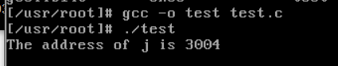
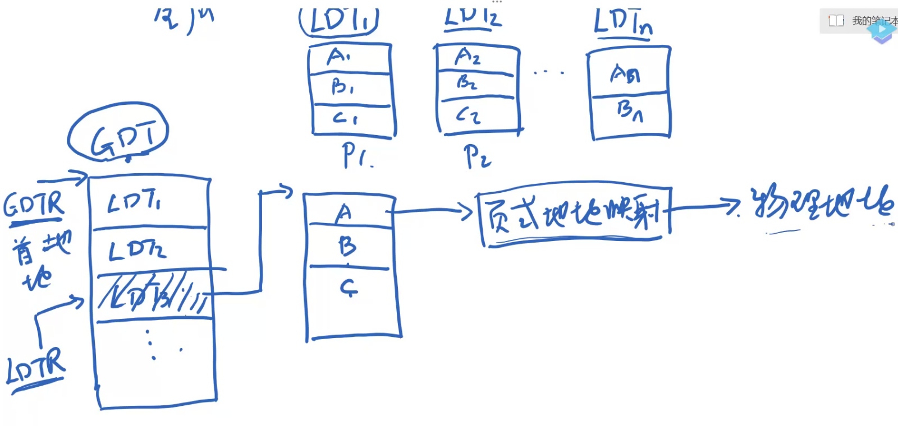
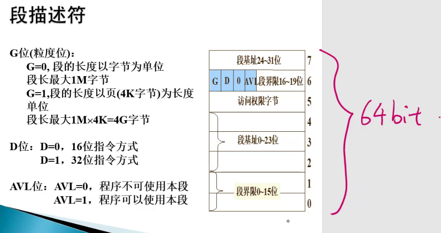
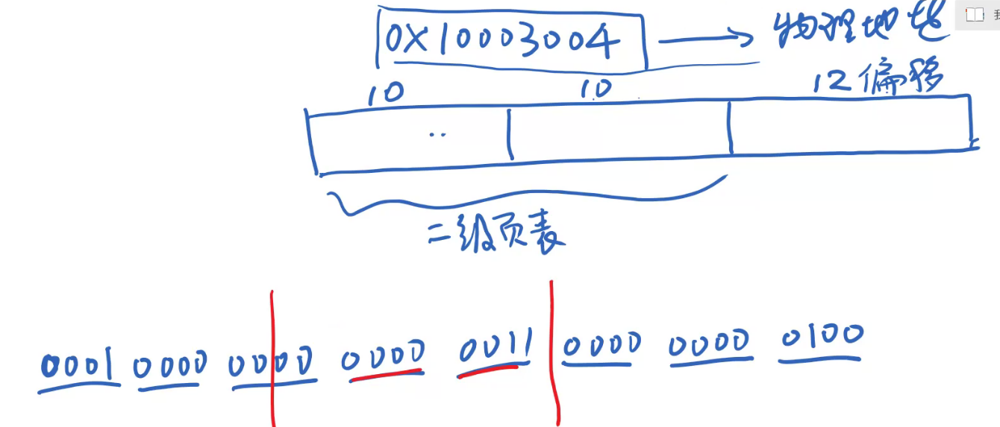
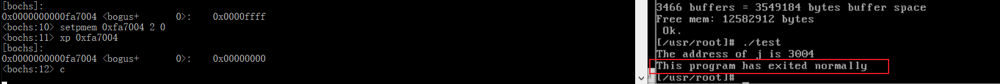

# OS实验_地址映射的过程

## 介绍

首先有这么一个.c文件

```c
#include <stdio.h>
int j = 0xffff;
int main() {
    // 打印全局变量j在内存的逻辑地址
    printf("The address of j is %x\n", &j);
    while (j!=0);
    // 按理该程序会死循环，不可能执行以下语句
    printf("This program has exited normally\n");
    return 0;
}
```

背景是：

简单段页式管理（程序、数据一开始就全装入内存中），区别请求段页式（装一部分，需要再请求）

大端计数（低位在高地址，高位在低地址）


这个打印的地址应该不是实际内存的地址，

然后我们通过课程所学的段页式、多级页面，去计算这个j真正的物理地址，然后修改内容为0，这样如果这个程序打印了最后一句话，说明我们成功了，同时这个过程也掌握了地址映射的具体流程


在我当前环境，j的逻辑地址是0x3004




先回顾一下段页式，段是基础，段里面有页（段是为了方便操作内存，页是为了充分利用内存空间，减少外碎片）


GDT（Global Decripter Table）、LDT（Local Decripter Table）这两个系统寄存器


一个进程对应多个段，存在其局部LDT中，也就是一个进程对应一个LDT，存着里面各段信息

全局描述符表GDT存着进程对应一个LDT

GDT地址在GDTR，LDTR存当前进程对应那个LDT在GDT这个表的索引



总结：

通过`sreg命令`可以知道GDTR的值，进而知道GDT首地址

再看LDTR的值得到GDT的索引，知道GDT表项宽度，从而定位那个表项，得到LDT首地址

LDT首地址也就是该进程段表地址，根据段表结构（段长+基地址）


sreg命令：system register 系统寄存器

```bash
<bochs:2> sreg
es:0x0017, dh=0x10c0f300, dl=0x00003fff, valid=1
        Data segment, base=0x10000000, limit=0x03ffffff, Read/Write, Accessed
cs:0x000f, dh=0x10c0fb00, dl=0x00000002, valid=1
        Code segment, base=0x10000000, limit=0x00002fff, Execute/Read, Accessed, 32-bit
ss:0x0017, dh=0x10c0f300, dl=0x00003fff, valid=1
        Data segment, base=0x10000000, limit=0x03ffffff, Read/Write, Accessed
ds:0x0017, dh=0x10c0f300, dl=0x00003fff, valid=3
        Data segment, base=0x10000000, limit=0x03ffffff, Read/Write, Accessed
fs:0x0017, dh=0x10c0f300, dl=0x00003fff, valid=1
        Data segment, base=0x10000000, limit=0x03ffffff, Read/Write, Accessed
gs:0x0017, dh=0x10c0f300, dl=0x00003fff, valid=1
        Data segment, base=0x10000000, limit=0x03ffffff, Read/Write, Accessed
ldtr:0x0068, dh=0x000082f9, dl=0xc2d00068, valid=1
tr:0x0060, dh=0x00008bf9, dl=0xc2e80068, valid=1

gdtr:base=0x0000000000005cb8, limit=0x7ff
idtr:base=0x00000000000054b8, limit=0x7ff
```

ds：0x0017。

gdtr：0x5cb8。这是GDT表的首地址

ldtr：0x0068。使用全局描述符表、0b 1101（也就是索引是13）

GDT一个表项有多大：8B（64bits）

因此有了以上信息，我们就可以定位那个表项，打印该地址的值，知道LDT的地址

xp命令——打印，xp/2w 打印两个字（1个字4个字节），xp/2w 0x5cb8首地址+13下标*8字节

```bash
<bochs:4> xp/2w 0x5cb8+13*8
[bochs]:
0x0000000000005d20 <bogus+       0>:    0xc2d00068      0x000082f9
```

这个操作系统采用的是大端：因此段表首地址在000082f9拼接c2d00068 

根据下图可获取基地址是：0x00f9c2d0





知道了段表地址0xf9c2d0，里面有很多段，那j属于哪段呢？

注：我们听过数据段、代码段、程序段、堆栈段。而全局变量j它就在数据段。

数据段就是ds这个系统寄存器，他告诉我们在段表的哪个索引。ds：0x0017。<mark>和LDTR结构一样</mark>

得到索引是0b10（即2）

GDT、LDT格式一样，因此LDT宽度也是8个字节（64bits）

```bash
<bochs:5> xp/2w 0xf9c2d0+2*8
[bochs]:
0x0000000000f9c2e0 <bogus+       0>:    0x00003fff      0x10c0f300
```

10c0f300拼接00003fff。GDT、LDT格式一样，得到基地址0x10000000，这是数据段的基地址


而其实我们打印的0x3004是基于这个数据段的偏移量

所以0x10000000+0x3004 = 0x10003004，这就是j变量的线性地址

线性地址是真实物理地址 or 逻辑地址，取决系统有没有开启页式内存管理

- 开启了，这个线性地址是逻辑地址
- 没开启，这个线性地址是物理地址

因此我们看有没有开启页式内存管理，用creg命令，看CR0的最高位（1代表启动，0反之）

```bash
<bochs:6> creg
CR0=0x8000001b: PG cd nw ac wp ne ET TS em MP PE
CR2=page fault laddr=0x0000000010002fac
CR3=0x0000000000000000
    PCD=page-level cache disable=0
    PWT=page-level write-through=0
CR4=0x00000000: smep osxsave pcid fsgsbase smx vmx osxmmexcpt osfxsr pce pge mce pae pse de tsd pvi vme
EFER=0x00000000: ffxsr nxe lma lme sce
```

CR0=0x8000001b

CR3=0x0000000000000000

所以0x10003004是个逻辑地址

在这个系统中，他的地址组织形式是这样的，二级页表：10位+10位+12位页内偏移

切分如下，外层页号是0x40，内层页号是0x3，页内偏移是0x4



现在缺外层页表的首地址（即CR3的值，即0地址就是存页表）、外层页表的宽度（4个字节32bits）

所以现在能知道内层页表起始地址

```bash
<bochs:7> xp 0+0x40*4
[bochs]:
0x0000000000000100 <bogus+       0>:    0x00faa027
```

0xfaa027，而我们页表的结构是（20位块号 + 12位标识位）

所以内层页表起始地址在0xfaa号这个物理块（一个页表放在一个物理块，之前分析过了）

那页大小 == 物理块，物理块有多大，通过上面的页内偏移占12位（2^12），

我们就能知道0xfaa号物理块在内存的地址是0xfaa*2^12 = 0xfaa000

也就是内层页表的起始地址是0xfaa000，接下来还是一样的套路，通过内层页号定位

```bash
<bochs:8> xp 0xfaa000+3*4
[bochs]:
0x0000000000faa00c <bogus+       0>:    0x00fa7067
```

同样从0xfa7 067，得到物理块号为0xfa7（后面是标志位）


最后最后，得到该物理块的地址0xfa7000，页内偏移为0x4

所以0xfa7004

```bash
<bochs:9> xp 0xfa7004
[bochs]:
0x0000000000fa7004 <bogus+       0>:    0x0000ffff
```

完结！找到了这个物理地址——0xfa7004，存着全局变量j的值（从最开始可以知道值就是0xfff）


最后！就是改变这个值，用setpmem命令

```bash
<bochs:10> setpmem 0xfa7004 2 0
<bochs:11> xp 0xfa7004
[bochs]:
0x0000000000fa7004 <bogus+       0>:    0x00000000
```

修改成功，接下来就是调试模式下continue程序，看看会不会有最后一个语句的打印

