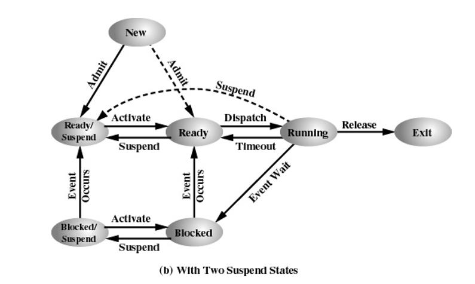
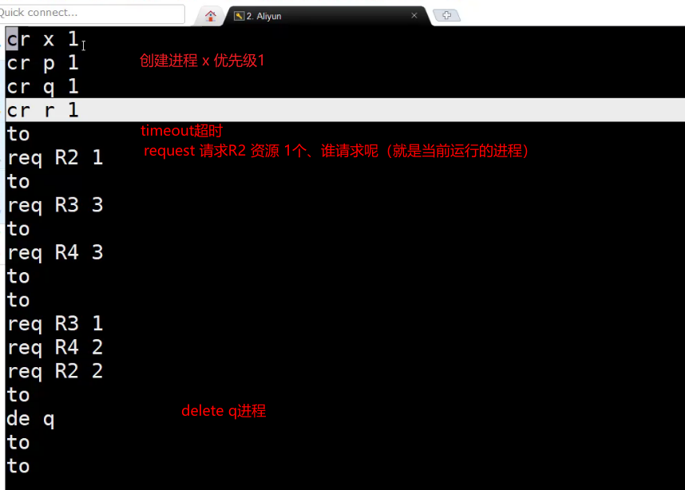

# OS实验_模拟进程资源管理

## 实验概述

进程有如下状态，



一个进程要想运行，它得**满足资源条件**，同时**被调度程序调度**

因此这个实验就是给你一个文件（里面是相关命令），主要命令如下

- cr 进程名 优先级
- to
- req 资源名 数量
- de 进程名

样例命令如下



目标：模拟这些命令，打印出程序的调度过程（在执行哪个进程）


## 1、从文件读取命令，获取每个命令的参数

java的文件读写方式，split函数按空格分割，很方便

```java
public class readCommand {
    // 单例模式：只创建一个【读命令器】
    private static readCommand readCommand = new readCommand();

    private readCommand() {}

    public static readCommand getInstance() {
        return readCommand;
    }

    public boolean readCmdFromFile(String path, List<String[]> cmd) {
        try {
            BufferedReader br = new BufferedReader(new InputStreamReader(new FileInputStream(path), "UTF-8"));

            String line = "";
            String[] parameters = null;
            while ((line = br.readLine()) != null) {
                parameters = line.split(" ");
                // 长度一定 >= 1
                if (parameters.length <= 0) {
                    System.out.println("read command FAIL");
                    return false;
                }
                cmd.add(parameters);
            }
            br.close();
        } catch (IOException e) {
            e.printStackTrace();
        }
        return true;
    }
}
```

## 2、创建PCB——保存进程状态的类

不理解的去了解一下OS的PCB结构


4类资源，R1，R2，R3，R4，每类资源Ri有 i 个

3个优先等级

```java
public class PCB {
    /**
     * pid:             进程名字
     * holdResources:   占用的资源，只有4个资源，所以就用一个int[5]
     * needResources:   申请资源不足而阻塞，记录这个信息用于从阻塞恢复就绪
     * type:            运行态 run/阻塞态 block/就绪态 ready
     * readyList:       就绪队列的引用
     * blockList:       阻塞队列的引用
     * father:          父进程的PCB引用
     * children:        子进程们
     * priority:        优先级 0 init/ 1 user/ 2 system
     */
    private String pid;
    private int[] holdResources = new int[5];
    private int[] needResources = new int[5];
    private String type;
    private List readyList;
    private List blockList;
    private PCB father;
    private LinkedList<PCB> children;
    private int priority;

    /**
     * 进程一旦创建，名字、阻塞、就绪队列、创建我的父进程、优先级 得知道！！
     * 而一开始肯定不占任何资源，类型也一定是就绪态，没孩子进程
     * @param pid
     * @param readyList
     * @param blockList
     * @param father
     * @param priority
     */
    public PCB(String pid, String type, List readyList, List blockList, PCB father, int priority) {
        this.pid = pid;
        this.type = type;
        this.readyList = readyList;
        this.blockList = blockList;
        this.father = father;
        this.priority = priority;
        // 约定
        // 一开始所占资源都是0
        for (int i = 0; i < holdResources.length; i++) {
            holdResources[i] = 0;
            needResources[i] = 0;
        }
        this.children = null;
    }

    public int getPriority() {
        return priority;
    }

    public int[] getHoldResources() {
        return holdResources;
    }

    public int[] getNeedResources() {
        return needResources;
    }

    public String getPid() {
        return pid;
    }

    public void setType(String type) {
        this.type = type;
    }
}
```


## cr命令分析

> 一创建就是就绪态，加入就绪队列，姑且不考虑 就绪队列满，新建就去就绪挂起的情况把（如果需要，后面改成ArrayList限定长度）
>
> 
>
> 情况1：如果第一个，应该直接运行态
> 情况2：否则放就绪队列


## to命令分析

> 1、运行的变就绪的（不考虑运行时遇到系统调用导致阻塞的情况），重放就绪队列
> 2、更新nowProcess 从优先级高的看谁就绪，没有就null


## req命令分析

> 1、如果够则分配成功，当前PCB上记录
> 2、不够则nowProcess进阻塞队列，重新调度新的进程


## de命令分析

> 1、找这个名字的pcb，记为deletepcb。可能在nowProcess、阻塞队列、就绪队列
> - 如果删除的是正在执行的，应该重新调度
>
> - 其它就直接删就好
>
> 2、释放deletepcb所占资源，资源从【1，4】 约定了：只会占一种资源，不过还是得扫描
> 3、更新nowProcess，因为恢复了资源，我得看看对应的阻塞队列哪些可以恢复（考虑优先级、满足条件的【利用曾经req资源的个数】）


## 实验遇到的困难

存不存在，一个进程，多次to，那每次执行会出现req不同资源，或者有没有那种第一次req A 2

第二次req A 3

> 个人感觉：一个进程能运行了，应该是有且仅有 用这么一种固定的资源，不可能说分开获取不同资源，然后还缺少某种资源的时候还能运行


## 其它

father、孩子进程引用一直没用上

