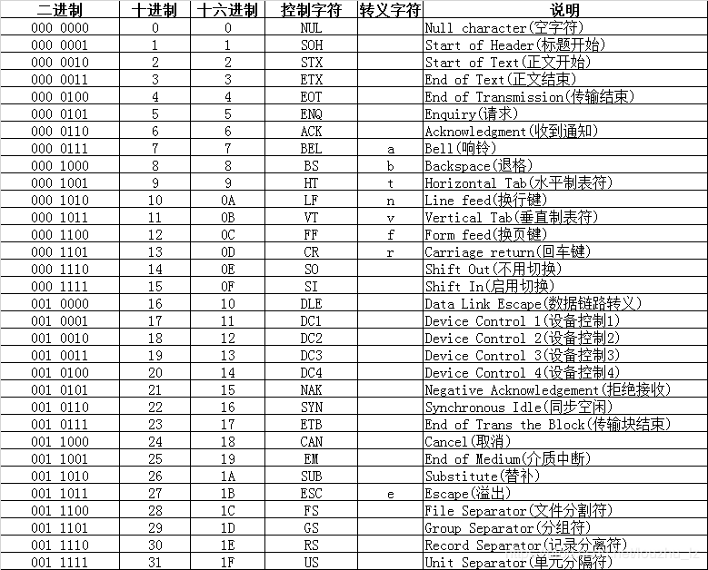

# 实战

## 1、Segmentation Fault原因总结

我由于if、else if漏掉一个条件，然后运行就报了这个段错误

[更多参考博客](https://blog.csdn.net/qq_36589706/article/details/81505221)


## 2、makefile教程——处理多文件链接

新建makefile文件，名字不能改

要有tab键，注意如果设置了tab键转空格，一定要改回tab键

```js
/*
目标: 依赖
Tab键+命令
*/
test: test.c
	gcc test.c -o test	//最前面一定要是Tab键
留一行    
```

运行直接打`make命令`

那多文件呢，gcc test.c test2.c test3.c -o main

相比makefile有什么不好，如果某个文件改动了，如test2.c，上面这样的每次所有文件都要重新编译生成目标文件，再链接。而makefile的话只重新编译改的那个，大大节省时间


```js
// 推荐用变量，方便后续改编译器选项、条件  使用方式：$(变量)
CC = gcc
CFLAGS = -g -lm


// 【makefile 只根据第一条】，如何弄多个可执行文件
//all: main_max main_min

// 【从后往前写，执行方向是从下到上，就是往下找需要的】
main: main.c tool.o
	$(CC) main.c tool.o -o main

tool.o: tool.c
	$(CC) -c tool.c	//-c 代表目标文件名字和你.c的一样

// 【推荐】加一段删除脚本，因为后续发布 不需要这些
clean:
	rm *.o main
    
```

[B站教程](https://www.bilibili.com/video/BV1Mx411m7fm?from=search&seid=11596285929611935544)


## 3、动态链接库DLL

即 Dynamic-Link Library。

为什么要用这个东西

> 想想程序之间其实有相当多的**重复代码**。在DOS时代，做法是把这些重复的代码写成一个个的函数，放到不同的库文件中去。当要使用这些函数时，只要把您的目标文件（. obj)文件和先前存放在库文件中的函数进行链接，链接时链接器会从库文件中抽取相关的信息并把它们插入到可执行文件中去。这个过程叫做`静态链接`。C运行时库就是一个好例子。
>
> <mark>缺点</mark>：在每一个调用库函数的程序中都必须嵌入同一函数的**拷贝，这显然很浪费磁盘。**
>
> 
>
> 在DOS时代毕竟每一时刻仅有一个程序在运行，所以浪费的还只是磁盘而已，在多任务的WINDOWS时代就不仅浪费磁盘，还要浪费宝贵的内存了。 
> 在WINDOWS中，由于有多个程序同时运行，如果您的程序非常大的话，那将消耗相当多的内存。WINDOWS的解决办法是：使用`动态链接库`。
>
> 
>
> 动态链接库从表面上看也是一大堆的通用函数，不过即使有多个程序调用了它，在内存中也仅仅只有动态链接库的**唯一一份拷贝**。WINDOWS是通过**分页机制**来作到这一点的
>
> <mark>优点</mark>：库的**代码只有一份**。每一个应用程序有自己单独的数据段，不会乱掉
>
> 不象旧时的静态链接库，它并不会把这些函数的可执行代码放入到应用程序中去，而是**当程序已经在内存中运行时，如果需要调用该函数时才调入内存也即链接**。 这也就是为什么把它叫做“动态”的原因所在
>
> 
>
> <mark>总结一下：几个使用DLL的点</mark>
>
> **多个exe共用一个DLL，内存只加载进去一份，节省memory**
>
> **你不想你的源码给人家，但又想人家用你的函数，那这时候你可以给你的so文件，让人家用**
>
> **用DLL可以让项目模块化，有时候只更新重新编译过的DLL就可以了，其他的东西不用动**

使用方法：

① 生成动态库libtest.so

```js
// -fpic：生成位置无关代码，用相对地址
// -shared：链接时告诉有动态链接库
// 参考下面“-I”（大写i），“-L”（大写l），“-l”（小写l）
g++ -fpic -shared -o libtest.so a1.cpp a2.cpp
```

②  使用动态链接库，在代码上用相应的函数打开它，调用它、关闭它

```js
#include<dlfcn.h>
// 返回NULL出错，mode一般是【RTLD_LAZY】：动态的加入动态链接库中的函数
void *dlopen(const char *file, int mode);
// 返回NULL出错，FuncName：动态链接库中的函数名
void *dlsym(void *handle, const char *FuncName);
// 当dlopen、dlsym等函数出错时，dlerror返回字符串说明这些函数出错的原因
char *dlerror();
// 卸载动态链接库
int dlclose(void *handle);
```

✨注：**C语言没有重载**，所以对于dlsym函数的FuncName函数名完全就是那个包含在动态库文件的函数名，是相等的。而**C++有重载**，因此需要`nm xxx.so`文件去看看具体编译成什么名字，再赋值给FuncName。或者在相应的函数前加上`extern "C" `，这样C++就会按C的风格，不改名

③ 动态库使用者的编译，也就是编译那个写了大量操作动态库函数代码的cpp文件，加`-ldl`

```js
g++ main.cpp -o main –ldl
```


我们用gcc编译程序时，可能会用到**“-I”（大写i），“-L”（大写l），“-l”（小写l）**等参数

`-I`（大写i）就代表include那些，即头文件目录

`-L`（大写L）就代表link链接的库目录

`-l`（小写l）就代表so文件名，动态库如果命名遵循 `libxxx.so的话，就写成-lxxx`

> 例：
>
> `gcc -o hello hello.c -I /home/hello/include -L /home/hello/lib -lworld`
>
> 上面这句表示在编译hello.c时：
>
> `-I` /home/hello/include表示将/home/hello/include目录作为第一个寻找**头文件的目录**，寻找的顺序是：/home/hello/include-->/usr/include-->/usr/local/include 
>
>  
>
> `-L` /home/hello/lib表示将/home/hello/lib目录作为第一个寻找**库文件的目录**，寻找的顺序是：/home/hello/lib-->/lib-->/usr/lib-->/usr/local/lib
>
>  
>
> `-lworld`表示在上面的lib的路径中寻找**libworld.so动态库文件**（如果gcc编译选项中加入了“-static”表示寻找libworld.a静态库文件），程序链接的库名是world


## 4、遍历某路径下的文件

```c++
#include <dirent.h>

DIR *dir;
struct dirent *dt;

//出错返回NULL
if ((dir = opendir(pluginPath)) == NULL) {
    printf("opendir   %s   error\n", pluginPath);
    return false;
}

while ((dt = readdir(dir)) != NULL) {
    //获取文件名字，转成string，方便拼接
    string fileName = dt->d_name;
    //过滤掉 .  和 ..
    if (fileName[0] == '.' ||
        fileName.substr(fileName.length() - 3, 3) != ".so") {
        continue;
    }
    string wholePath = pluginPath;
    wholePath += "/" + fileName;
    v_plugin.push_back(wholePath);
}
closedir(dir);
```

## 5、关于编码问题

在做一个学校实验《序列化》的第5个版本时，遇到了bug，我需要确定序列化进去的内容是否是我希望的，而当我把这个data文件下载在Windows时，全是SOH、NUL、STX这些字眼。对应关系如下




先介绍一下我们常见的术语把

- `ASCII码`：一共规定了128个字符的编码，占用一个字节的后7位，最前面的1位统一规定为0
- `Unicode`：将世界上所有的符号都纳入其中。每一个符号都给予一个独一无二的编码
- `utf-8`：是一种**变长**的编码方式。它可以使用1~4个字节表示一个符号，根据不同的符号而变化字节长度
- `utf-16`：字符用两个字节或四个字节表示
- `utf-32`：字符用四个字节表示

> 它们之间的关系是：
> `ASCII码`只有128个字符，不够用。因此出现了`Unicode`，
> 但是呢有的字符表示只需要1个字节、有的要2个字节，甚至更多，到底哪种标准
> 所以就有了这些Unicode的实现：`UTF-8、UTF-16、UTF-32`
>
> **utf-8是变长的，就很香，所以就越普遍用**


扩展：UTF-8的编码规则很简单，只有二条

> 1）对于单字节的符号，字节的第一位设为0，后面7位为这个符号的unicode码。因此对于英语字母，UTF-8编码和ASCII码是相同的。
>
> 2）对于n字节的符号（n>1），第一个字节的**前n位都设为1**，第n+1位设为0，后面字节的前两位一律设为10。剩下的没有提及的二进制位，全部为这个符号的unicode码。
>
> 
>
> 解读UTF-8编码非常简单。
>
> 如果一个字节的第一位是0，则这个字节单独就是一个字符；
>
> 如果第一位是1，则连续有多少个1，就表示当前字符占用多少个字节。

[参考博客](https://blog.csdn.net/louzhu_lz/article/details/97154414)


## 6、O_CREAT需要写权限

O_CREAT代表创建新文件，是不能搭配只读O_RDONLY的。搭配会报`Bad file descriptor`

新文件才创建，你不给写权限，还读啥。。。

几个注意点：

- 用O_CREAT就必须搭配有写权限，即O_WRONLY  或者  O_RDWR
- 用O_CREAT对于已经存在的，会使用，不存在则创建，不是对存在的会覆盖
- 要检测文件存在，O_CREAT 和 O_EXCL 同时使用，文件存在open会返回-1

[详细open函数参数使用](https://blog.csdn.net/chenqiai0/article/details/8763922)


## 7、 linux下read、write函数的细节注意

当设定O_APPEND标志，

write底层工作原理是：先获取inode节点的文件长度，然后将偏移量设置=文件长度， 也就是偏移量设成文件末尾，接下来才去写内容

**总结如下：**

> 对于设置了O_APPEND标志的， 
>
> write不管当前偏移量是多少，**总是末尾**添加数据。 
>
> read是根据当前偏移量进行读操作的。

!>✨注：一般打开一个可读可写的文件O_RDWR之后，我们会write内容，但请注意你希望从头读内容时得事前 **lseek一下文件偏移量到开头**，上面说了嘛，靠偏移量读写的！！


## 8、Vim个人使用命令、vi没高亮

在root用户下，vi一个程序，没有任何高亮的问题说因为：用的vi不是vim，而是usr/bin/vi。而对于其它用户，它的vi是vim的别名。具体可以用`which vi` 命令验证

**所以以后打开文件就vim把，或者弄个别名**


`:set number` 显示行号，方便gdb对哪个行号打断点

**永久改法：在/etc/virc文件末尾加一行set number就好了**

复制/粘贴/剪切/撤销

- `yy`  复制游标所在行整行 
- `p小写`   粘贴至游标后（下） 
- `dd` 剪切游标所在行整行 
- `:u` 命令可以撤销最近一次操作

[粘贴板等更多具体操作参考](https://blog.csdn.net/feng98ren/article/details/80509607)


## 9、GDB个人常用命令

首先得安装，`yum install gdb`

- `gdb 可执行文件`：以GDB方式运行，**注意编译时加-g**，以便加入调试信息
- `b 行号`、`b a.cpp:行号`：打断点，break的简写
- `disable/enable break n`：  禁用/使能某个断点 ，n为断点号
- `delete break`： 删除所有的断点
- `info b`： 查看所有断点信息
- `r`：运行，有断点则停住，run的简写
- `c`：继续执行，到下一个断点，continue的简写
- `ctrl + d`、`q`：退出gdb，quit的简写
- `p/格式 变量`：打印变量内容，经常用于检测其值对不对，格式是十六进制那些

| 格式 | 说明                 |
| :--: | :------------------- |
|  x   | 显示为十六进制数     |
|  t   | 显示为二进制数       |
|  u   | 显示为无符号十进制数 |
|  d   | 显示为十进制数       |
|  c   | 显示为字符（ASCII）  |
|  a   | 地址                 |
|  s   | 显示为字符串         |