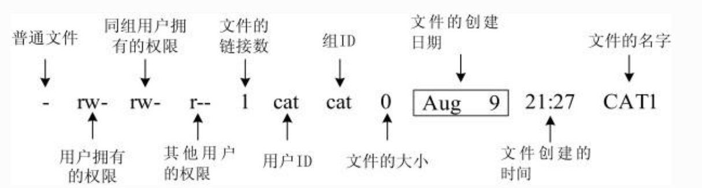

# 文件

## 1、`ls -l` 打印的信息代表什么意思

[具体参考该博客](https://www.linuxidc.com/Linux/2019-01/156596.htm)

## 2、read、write的细节

当设定O_APPEND标志后，能否使用lseek函数修改当前文件偏移量？若能修改，`读写`操作发生在文件何处？

**总结如下：**

> 对于设置了O_APPEND标志的， 
>
> write不管当前偏移量是多少，`总是末尾添加数据。 `
>
> ✨注：write底层工作原理是：先获取inode节点的文件长度，然后将偏移量设置=文件长度， 也就是偏移量设成文件末尾，接下来才去写内容
>
> read是`根据当前偏移量进行读操作`的

## 3、 作业：实现ls -R、ls -l

通过opendir、readdir操作目录项，文件信息存储在stat结构体上，其st_mode字段有文件类型、权限的信息，用相应的宏判断就好

