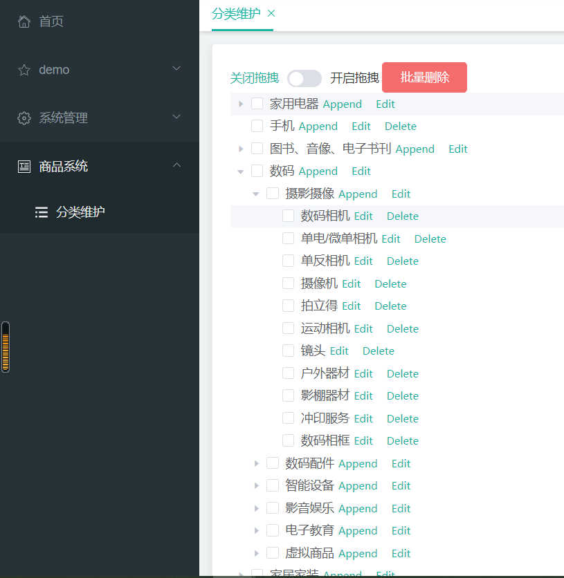
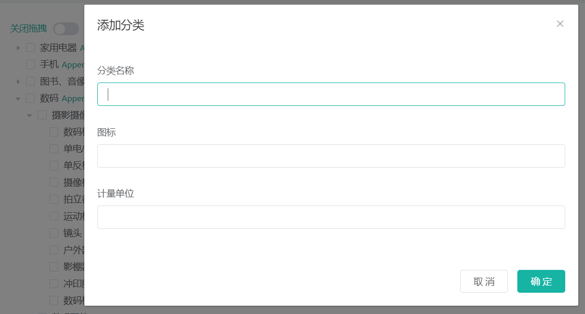
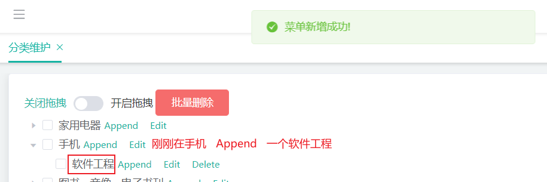
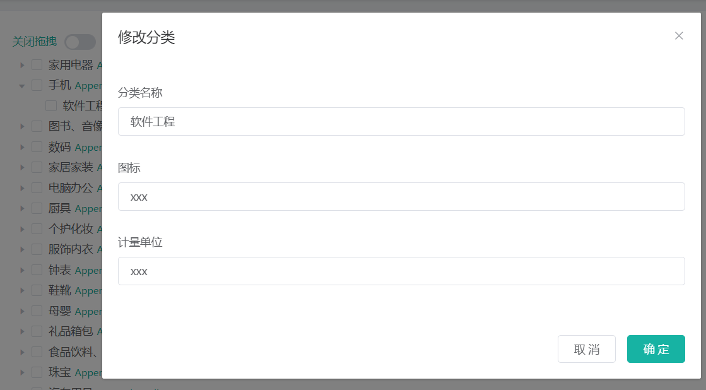
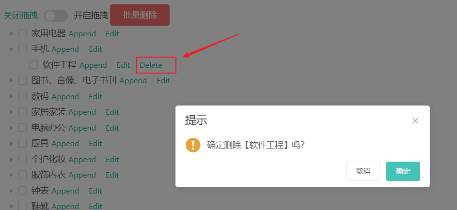
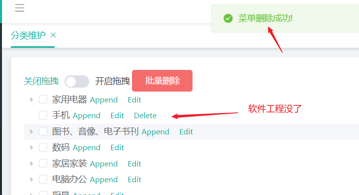
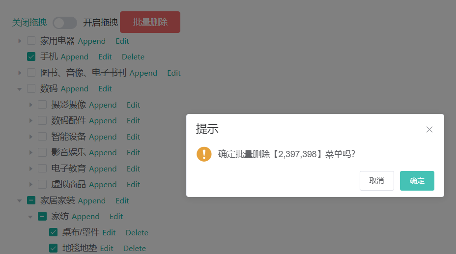
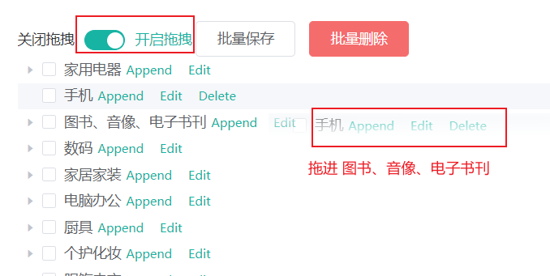
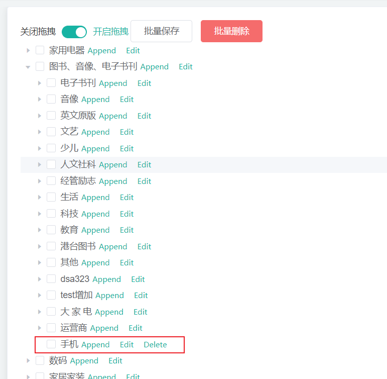

# 商品服务_三级分类

## 背景描述

有三个主体

- 数据库的`pms_category表`
- 后端管理中心
- 前端商城

---

`pms_category表`有如下字段

|     字段      |             注解             |
| :-----------: | :--------------------------: |
|   `cat_id`    |            分类id            |
|    `name`     |           分类名称           |
| `parent_cid`  |      父分类id，一级是0       |
|  `cat_level`  | 当前分类所属层级（【1，3】） |
| `show_status` | 用于逻辑删除：1显示，0不显示 |
|    `sort`     |  从0开始，同类别的先后顺序   |
|     icon      |           图标信息           |
| product_unit  |    该类别的单位。如件、个    |

✨注：标注的是有用字段，后两个暂时没太大用处

----

后端管理中心中：`商品系统 --> 分类维护` 页面

使用了一个树形控件。去可视化`pms_category表`类别的层级关系

目的如下：

- 可视化操作这个控件，能同步到数据库。
- 进而前端商城的导航栏动态更新（数据库变了，前端发请求获取数据库信息进行渲染，自然就变，而不用改前端代码）

效果图如下：

----

## 效果演示

具体操作如下：

`pms_category表`每一项都有其Append、Edit、Delete按键

✨注：第三级没Append，因为弄的是三级分类。Delete值安排在没孩子节点（避免误删操作）

Append按钮效果图：

点击Edit访问数据库回显信息，比如点刚刚Append的软件工程。

可以进行修改，写入数据库

删除操作

还可以批量删除

拖拽功能，打开拖拽按钮，拖拽完成后，点击批量保存即可存入数据库

## 安排事项

由于我得运行后端product模块，才能发请求获取数据库data。

大家也不在同一机子上，而且数据我也是乱造的，不是我们ppt主题那些

前端安排一下，志杭？你有阿里云是把，docker部署easy-mock

按照`pms_category表`的结构，造几个数据（我们一级分类就好）

如下

|     字段      |   数据   |
| :-----------: | :------: |
|   `cat_id`    |    1     |
|    `name`     | 分类名称 |
| `parent_cid`  |    0     |
|  `cat_level`  |    1     |
| `show_status` |    1     |
|    `sort`     |    0     |
|     icon      |   null   |
| product_unit  |   null   |

造5、6个。放easy-mock上

然后开放安全组，并让其一直运行，让前端小伙伴能发请求获取来渲染

后面后端写好并部署之后，前端小伙伴改下地址访问我们项目的数据库就好了