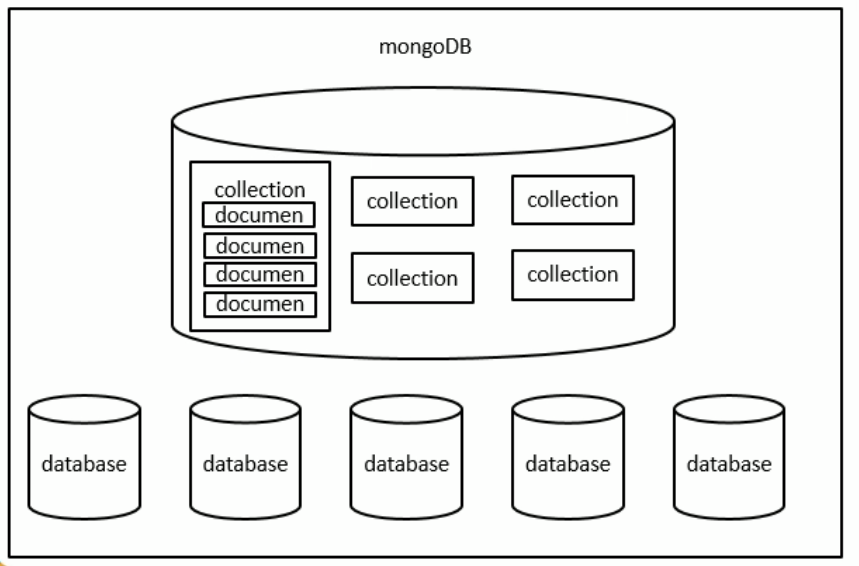

# MongoDB

## 数据库分类

- 关系型数据库RDBMS

  MySQL、Oracle、DB2、SQLServer

  特征：都是表

- 非关系型数据库NoSQL（Not Only SQL）

  **键值对**数据库Redis

  **文档**数据库MongoDB


## 概念

面向文档，什么是文档，即类似JSON的结构，叫`BSON`


数据库可以放`集合Collections`（类似数组，如JSON格式），集合里面可以放 `文档Documents`（文档数据库的**最小单位**，我们操作的就是文档）

类比关系型：集合即表、文档即记录



## MongoDB优势

相比关系型前期的表定好就不能改了，而mongodb方便扩展，灵活。


## 安装

建议单独安装mongodb官方可视化工具：[MongoDB Compass](https://www.mongodb.com/download-center/compass)


[linux上安装的官方文档](https://docs.mongodb.com/manual/tutorial/install-mongodb-on-red-hat/)

我的阿里云是Centos7，记录一下我的安装步骤（下面提到别的均可在官方文档找到）

① 去到 `/etc/yum.repos.d/`路径，在其下弄一个`mongodb-org-4.2.repo`文件，内容为

```js
[mongodb-org-4.2]
name=MongoDB Repository
baseurl=https://repo.mongodb.org/yum/redhat/$releasever/mongodb-org/4.2/x86_64/
gpgcheck=1
enabled=1
gpgkey=https://www.mongodb.org/static/pgp/server-4.2.asc
```

② `sudo yum install -y mongodb-org` 用yum安装，指定版本or不自动更新参考官方文档

③ 只要是上面这个命令，相关mongodb的data、log文件夹已经创好。不是该命令则自己mkdir

④ `ps --no-headers -o comm 1` 看看自己系统用的是 systemd 还是 init 启动mongodb

⑤ 我的是 systemd。

- 启动程序：`sudo systemctl start mongod`，

- 上面报错执行：`sudo systemctl daemon-reload`

- 看是否起成功：`sudo systemctl status mongod`

- 停程序：`sudo systemctl stop mongod`

- 重启程序：`sudo systemctl restart mongod`

- 使用：`mongo`

- 卸载：先停服务、删除相关包、删除data、log

  ```js
  sudo service mongod stop
  
  sudo yum erase $(rpm -qa | grep mongodb-org)
  
  sudo rm -r /var/log/mongodb
  sudo rm -r /var/lib/mongo
  ```

✨远程连接mongodb时，27017端口连接不上的办法，[参考博客](https://www.cnblogs.com/lindsay-chh/p/4734568.html)

- 安全组开放27017端口
- mongodb的配置文件中的bind_ip 默认为127.0.0.1，默认只有本机可以连接。 此时，需要将bind_ip配置为0.0.0.0，表示接受任何IP的连接。
- <mark>防火墙阻止了27017端口</mark>，centos7关闭命令：`systemctl stop firewalld`

[window安装的坑，特别那个安装需要权限](https://blog.csdn.net/qq_20084101/article/details/82261195)

[B站3个环境安装教程](https://www.bilibili.com/video/BV1hW411d7q7?from=search&seid=1394345462001855876)


## 在mongo Shell的命令

看数据库个数：`show dbs / databases`

用哪个数据库：`use xxx`，看当前在哪个数据库，即一个变量：`db`

✨注意：我们不需要手动创建数据库。不用担心不存在，能进入，当操作数据之后，会自动创建

看数据库所有集合个数：`show collections`


## CRUD操作

① Create

`db.collection名.insert(JSON对象)`，是`insertOne({})`、`insertMany([])`合体


② Read

`db.collection名.find()`，返回数组。**传一个对象{}，代表查询条件**，求长度就`数组.count()` or length()

有`db.collection名.findOne()`，返回对象

mongodb自动给文档生成_id（用来保证唯一性，可以自己指定但不推荐）


③ Update

`db.collection名.update({查询条件}, {新对象}, {配置选项})`，因此推荐使用更具语义的`db.collection名.updateMany()`、`db.collection名.updateOne()`

- 查询条件同上
- 新对象默认覆盖掉匹配的**第一个（由于配置选项的multi默认false）**，而且是<mark>完全覆盖</mark>，并不上修改对应新对象的属性值。如果只是修改、删除某个属性值用`$set:{}、$unset:{}`
- 配置选项有multi属性，默认false


④ Delete

`db.collection名.remove()`，默认删多个，第二个参数justOne给true就删一个

注remove()一定要传对象，但注意如果空对象，**会清空！！！而且性能不好，因为是匹配再删**，应该`db.collection名.drop()`

删数据库`db.dropDatabase()`

注：集合没了，数据库自动删

`db.collection名.deleteOne()`

`db.collection名.deleteMany()`

注：其实一般公司都不删Data，只是用个字段标识


## Mongoose

这个东西让我们通过Node来操作MongoDB模块

是一个对象文档模型（ODM）库，类比ORM

说白就是映射成对象，用对象操作数据库


好处

- Mongodb本身约束很少，比如你往salary写"hello"也行。通过mongoose可以创建一个模式结构（Schema），它来约束字段类型、长度等等
- 可以对模型中对象/文档验证
- 方便的类型转换

新的对象（按序使用）

- Schema：用来约束文档结构
- Model相当于里面的集合
- Document相当于里面的文档


[使用教程](https://www.bilibili.com/video/BV1NW411T7vT?p=15)

创建Schema，用Schema创建Model（将数据库的集合名 和 约束对象Schema绑定），通过Model创建文档


注意：mongodb一般只需要连接一次，因为这种非关系型数据库没有事务

而对于关系型，每一次操作就重连接，正正由于事务这个东西

🎈待理解重连接、事务的关系


## 总结

- 3.2 引入了**更具语义化的xxxOne、xxxMany。推荐使用**，因为省去给多一个配置参数
- **不推荐覆盖文档自带的_id**，因为这样得靠自己保证唯一性
- 套路都是db.collection名.xxx，然后传的都是对象
- 创库、删库不用管。插入了文档，自动建库、删完了集合自动就删库
- CRUD操作都是比较费时间的，尽量少，比如放2w条数据，我应该在外面加入到一个数组，然后insert一次，而不是for 2w次insert
- 关于find()，它的这个筛选对象{A属性: 'a1'}，也包含A数组中**<mark>有</mark>a1这个值**，也能查到
- findxxx操作注意返回的类型（数组 or 对象，数组才能count()），update注意**不想新对象<mark>完全覆盖</mark>**用`$set`，`$unset`**那个属性值随意就好，不能空**；`deleteMany/remove`一定要传对象（但**一定不要空，空是全匹配删除**，而且也不高效）
- 一个文档就是一个{}，文档可以内嵌文档，即{ {} }，可以**通过内嵌文档的条件找**，用`.`，注意属性和属性值都**要用引号**
- $set不存在就加，存在就注意了（如果本身有data且你$set的东西<mark>表达的范围小于本身会覆盖掉，以前东西没了</mark>），如果是数组应该用`$push`追加，`$addToSet`有重复就不加
- 嵌套用到`.`就一定**要有引号**
- 查询控制范围：`$lt、$lte、$gt、$gte、$eq、$ne、$inc减就 加负数`
- 注意查询是字符串还是Number
- 数组`limit(10)`前十条、`skip(10)`跳前十条，用于分页，`sort({字段名: 1升序 or -1降序, ...})`，排序默认按_id升序（由机器码和时间戳组成）三者就算顺序颠倒也不怕，**会自动调整成sort、skip、limit的执行顺序**
- 只想查某列信息——投影，`find({}, {字段名: 1显示, _id: 0不显示})`，这个id不写默认1，所有要显式指定
- 文档的关系：一对一（一个文档里面嵌入一个文档）、一对多/多对一（嵌入一个数组，数组里一个个对象）、多对多。那不同的集合如果关联起来：<mark>在多的那里加入对于另外一方的id</mark>
- {$or: [     {A:{$lt: 100}},   {A:{$gt: 300}}     ]}