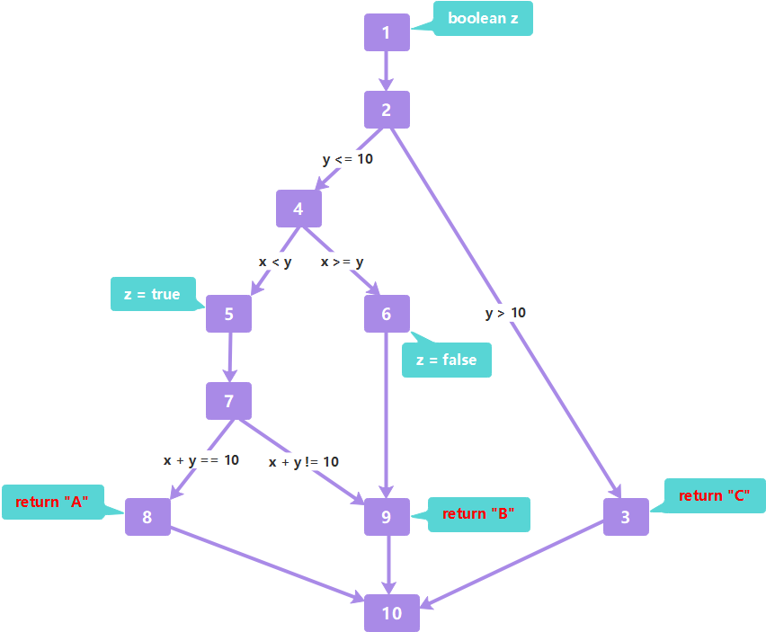

# 白盒测试

## 概念

!> 这里说的覆盖，就是说出现过这些情况就好了。举个栗子，A、B两段代码，我要做的是设计一个测试用例，能跑A、B代码。并不是跑A&&不跑B；跑A&&跑B、不跑A&&不跑B、不跑A&&跑B


`语句覆盖`：代码段覆盖

`分支覆盖/判定覆盖`：if结果真假覆盖

✨注：包括了语句覆盖

`条件覆盖`：if里面的具体条件拆分，并分成真、假，覆盖完

✨注：不一定包括了分支覆盖/判定覆盖。因为没有考虑到判定结果

`判定条件覆盖`（书上没）：

✨注：综合了条件覆盖、支覆盖/判定覆盖。但缺少组合

`条件组合覆盖`：对于每个if，同上，各个具体条件真假 ——》组合

✨注：包括了条件覆盖、分支覆盖/判定覆盖


---


控制流图（control flow graph，CFG）

1. 节点：语句段
2.  边：在边上注明相应的条件


`节点覆盖（Node Coverage, NC）`：就是点都走过

`边覆盖`：就是边都走过

`路径覆盖`：覆盖程序中所有可能的路径

✨注：方法有——基本路径测试——**路径数=边数-点数+2**


## 作业题

```java
public String foo(int x, int y){
    boolean z;
    // ①
    if(y>10)
        return "C";
    // ②
    if(x<y)
        z=true;
    else
        z=false;
    // ③
    if(z&&x+y==10)
        return "A";
    else
        return "B";
}
```

1）设计测试用例，达到`语句覆盖`标准。

| 用例编号 |  x   |  y   | 输出 |
| :------: | :--: | :--: | :--: |
|   TC1    | 任意 |  11  |  C   |
|   TC2    |  1   |  9   |  A   |
|   TC3    |  5   |  5   |  B   |

2）设计测试用例，达到`分支覆盖`标准。

| 用例编号 |  x   |  y   | 输出 |      备注       |
| :------: | :--: | :--: | :--: | :-------------: |
|   TC1    | 任意 |  11  |  C   |      ①true      |
|   TC2    |  1   |  9   |  A   | ①false、②③true  |
|   TC3    |  5   |  5   |  B   | ①false、②③false |

3）绘出代码对应的 CFG 图。




4）设计测试用例，达到`节点覆盖`标准。

| 用例编号 |  x   |  y   | 输出 |    备注     |
| :------: | :--: | :--: | :--: | :---------: |
|   TC1    | 任意 |  11  |  C   | 1、2、3、10 |
|   TC2    |  1   |  9   |  A   | 4、5、7、8  |
|   TC3    |  5   |  5   |  B   |    6、9     |


5）设计测试用例，进行`基本路径测试`。

根据公式：<mark>路径数=边数-点数+2</mark>

即路径数为 12 - 10 + 2 = 4

基线取 1、2、4、5、7、8、10


分析情况

Path_1：1、2、4、5、7、8、10

Path_2：1、2、3、10

Path_3：1、2、4、6、9、10

Path_4：1、2、4、5、7、9、10


## 总结

1、对于顺序执行的多行语句可只标识为一个节点，变量声明可视为一行语句

2、if语句是要从**同一个节点开始**

3、if里面多个条件是要分开处理，但这个题目里面一个条件依赖于前面的运行结果，枚举基本路径时需注意**有些基本路径无对应的输入参数**


## 参考资料

《软件工程教程-2012.9》