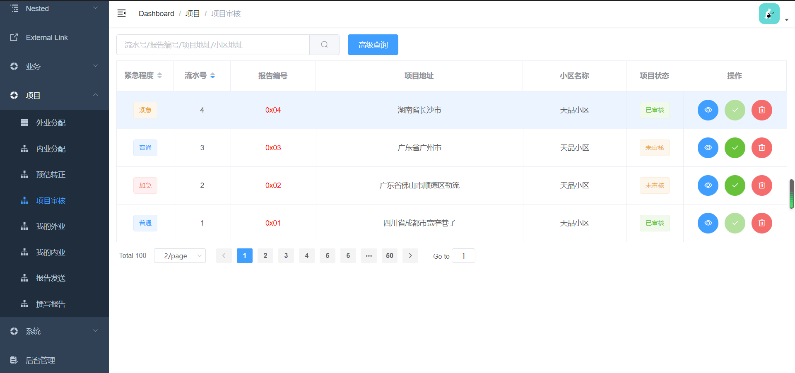

# 2020年5月29日周报

## 完成的功能

> ① 学习vue-admin-template，掌握了UI页面的搭建、结构
>
> 
>
> 
>
> ② 快速入门mongodb
>
> 
>
> ③ 学习了vuex，方便前端项目管理共享变量，[具体笔记参考博客](https://vvlhw.github.io/StayHungry/#/%E3%80%90Vue%E3%80%91/vuex)

## 项目以外

① 完成操作系统课程的【三个编程作业】、实验课上的【序列化】【动态库】。

> 对C++面向对象的特性有了更深的认识，以及掌握目录操作、插件的编写方法
>
> 了解了函数指针的一般写法、简写写法

② 几道关于树的面试题

> [面试题32 - I. 从上到下打印二叉树](https://leetcode-cn.com/problems/cong-shang-dao-xia-da-yin-er-cha-shu-lcof/)
>
> [面试题32 - II. 从上到下打印二叉树 II](https://leetcode-cn.com/problems/cong-shang-dao-xia-da-yin-er-cha-shu-ii-lcof/)
>
> [面试题32 - III. 从上到下打印二叉树 III](https://leetcode-cn.com/problems/cong-shang-dao-xia-da-yin-er-cha-shu-iii-lcof/)
>
> 简单的BFS
>
> 收获了一种在不记录结点所在层数信息的基础上，能控制一层层遍历的技巧
>
> [面试题68 - I. 二叉搜索树的最近公共祖先](https://leetcode-cn.com/problems/er-cha-sou-suo-shu-de-zui-jin-gong-gong-zu-xian-lcof/)
>
> [面试题68 - II. 二叉树的最近公共祖先](https://leetcode-cn.com/problems/er-cha-shu-de-zui-jin-gong-gong-zu-xian-lcof/)
>
> 特别是题二，利用null就返回另一边，两边都有就是答案，返回当前结点，而返回回去必定另一侧是null，就会选择性的一直把这个点返回上去最上层，这个技巧非常秀！

③ 学习了设计模式——观察者模式，[详情看博客](https://vvlhw.github.io/StayHungry/#/%E3%80%90%E8%AE%BE%E8%AE%A1%E8%80%85%E6%A8%A1%E5%BC%8F%E3%80%91/%E8%A7%82%E5%AF%9F%E8%80%85%E6%A8%A1%E5%BC%8F)

## 总结

快速入门Redis

过一遍俊威写的后端代码，周末上手

!> 希望学业、项目都兼顾，每天能有成就感